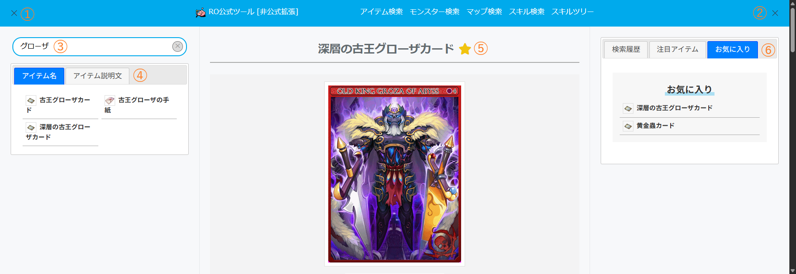

# RO公式ツール 非公式拡張

## アイテム検索 Rebuild

アイテム検索の画面遷移による複数検索の使いにくさや履歴情報へのアクセスの遠さなどUIを見直し、3カラム構成のアイテム検索に作り替えます。  

### Setup
次のどちらかで利用してください。XXXmonkey系に抵抗がないなら、自動で適用されるので楽です。
* XXXmonkey UserScript (Tampermonkey で確認)  
    * [UserScript](https://rag769.github.io/extras/rotool/item_search_3c.user.js)

* 下記をBookmarkletとして登録してください
    ```
    javascript:(function(){$.getScript("https://rag769.github.io/extras/rotool/item_search_3c.min.js");})();
    ```

### How to use

1. [RO公式ツールのアイテム検索](https://rotool.gungho.jp/item/) を開きます。

1. 登録したBookmarkletを実行します。それだけ

### Simple manual

#### サンプル画像


＊右カラムは初期表示時は閉じています

1. 左カラム（検索条件と検索結果）を開閉します
1. 右カラム（検索結果/注目アイテム/お気に入り）を開閉します  
1. 検索条件入力  
    * エンターキーで検索を行います
    * アイテム名検索とアイテム説明文検索の両方を一度に行います  
    * アイテム説明文検索は全角スペースで絞込ができます（アイテム名はヒットしなくなりますが...）
1. 検索条件で検索した結果をタブで分割して表示します
    * アイテム名 ... アイテム名検索した結果
    * アイテム説明文 ... アイテム説明文検索した結果
1. 検索結果や検索履歴からアイテムをクリックすると、アイテムが中央のカラムに表示されます  
    名前の横の☆をクリックするとお気に入りの登録と解除ができます
1. 公式の「検索履歴」「注目アイテム」に加えて独自実装した「お気に入り」の一覧をタブ分割して表示します

### Notes

* この拡張を使って発生したいかなる損害に関しても責任は負いません。
* 「とりあえず動けばいい」の雑実装なので、多くを期待してはいけません。  
    不具合等は「しょうがないにゃあ」と大きな心で受け止めてください。
* この拡張適用後に不具合が発生しても、RO公式ツールへの問合せ等は行わないでください。
* れっつえんじょい

© Gravity Co., Ltd. & Lee MyoungJin(studio DTDS). All rights reserved.  
© GungHo Online Entertainment, Inc. All Rights Reserved.  
当コンテンツの再利用（再転載・配布など）は、禁止しています。

---

## 露店取引情報フィルタ

露店取引情報にエンチャント・カードのフィルタ機能を付加します。(サンプル画像オレンジでマスク)  
グラフ表示をおまけで追加(サンプル画像グリーンでマスク)


### 2025－02－28 Update

フィルタをカードとエンチャで分離 (AND条件)


### Setup
* Greaseonkey・Tampermonkey UserScript (作者は Tampermonkey で確認)  
    * [フィルタのみ](https://rag769.github.io/extras/rotool/trade_filter.user.js)
    * [フィルタ＋グラフ](https://rag769.github.io/extras/rotool/trade_filter_scatter.user.js)

* DevToolでもアドレスバーでもどちらでも (ブラウザによっては全文コピペできません。Bookmarkletとしての利用を推奨)  
    フィルタのみ
    ```
    javascript:(function(){$.getScript("https://rag769.github.io/extras/rotool/trade_filter.min.js");})();
    ```
    フィルタ＋グラフ
    ```
    javascript:(function(){$.getScript("https://rag769.github.io/extras/rotool/trade_filter_scatter.min.js");})();
    ```

### How to use
※ XxxmonkeyのUserScriptをインストールしている場合は普通に無視してください ※

1. RO公式ツールでアイテム検索します

1. Setup のどちらかを実施します。  
    アイテム検索後のページでのみ有効です。リロード、別アイテム検索などした場合は再度実施してください。

### Notes

* この拡張を使って発生したいかなる損害に関しても責任は負いません。
* 「とりあえず動けばいい」の雑実装なので、多くを期待してはいけません。  
    不具合等は「しょうがないにゃあ」と大きな心で受け止めてください。
* この拡張適用後に不具合が発生しても、RO公式ツールへの問合せ等は行わないでください。
* れっつえんじょい

© Gravity Co., Ltd. & Lee MyoungJin(studio DTDS). All rights reserved.  
© GungHo Online Entertainment, Inc. All Rights Reserved.  
当コンテンツの再利用（再転載・配布など）は、禁止しています。
